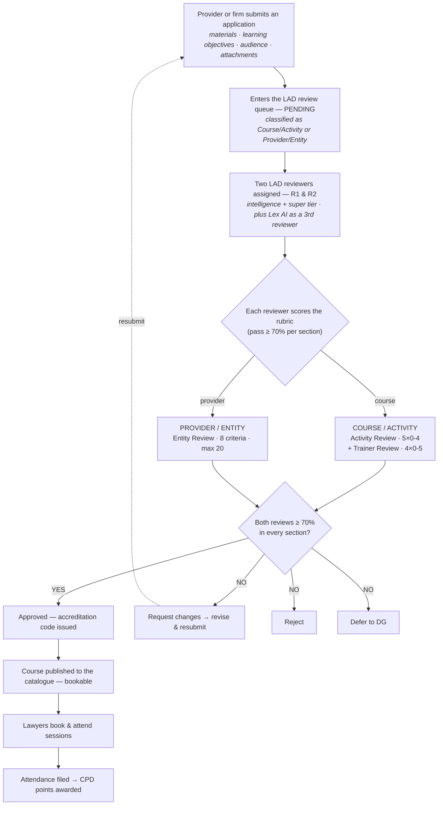

# CLPD Accreditation — Process Map

Editable source for the accreditation flow (renders on GitHub). The matching
image is `accreditation-process-map.svg`.

## Stages
1. **Submit** — a provider or firm submits an application (course materials, learning objectives, audience, attachments). Two kinds: a **Course/Activity** or a **Provider/Entity** registration.
2. **Review** — it enters the LAD queue as PENDING, gets **two reviewers (R1 & R2)** from the intelligence + super tier, and **Lex AI** adds a third-reviewer rationale. Each scores the rubric for the application type:
   - *Course/Activity* → **Activity Review** (5 criteria × 0–4) **+ Trainer Review** (4 criteria × 0–5).
   - *Provider/Entity* → **Entity Review** (8 criteria, max 20).
   - **Pass rule: both reviews must reach ≥ 70% in every section.**
3. **Decision** — if both pass → **Approve**; otherwise **Request changes** (back to the provider to resubmit), **Reject**, or **Defer to DG**.
4. **Go-live** — on approval an accreditation **code** is issued, the course is **published to the catalogue** (bookable), lawyers **book & attend**, and filed **attendance awards CPD points**.
</content>
